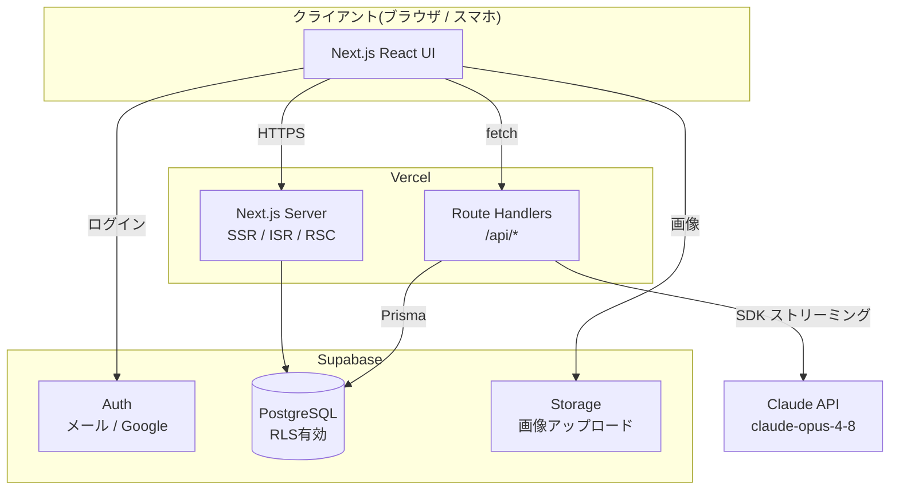
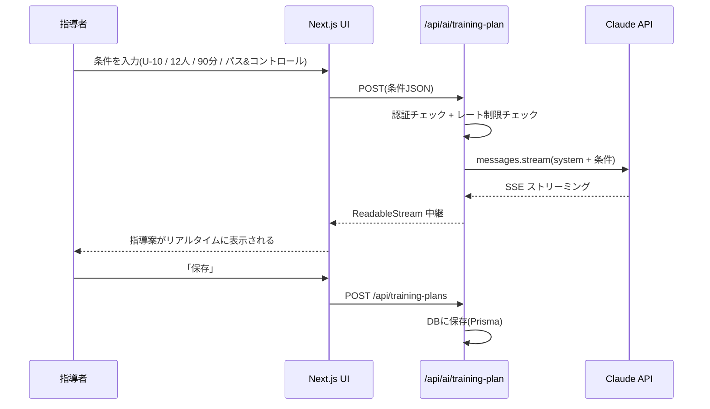

# 02. システム設計 — アーキテクチャ

## 1. 技術スタック

| レイヤ | 技術 | 選定理由 |
|---|---|---|
| フロントエンド | **Next.js 15 (App Router) + TypeScript + React 19** | 学習中のReact/JSの延長線上。SSR/ISRでブログに強い |
| スタイリング | **Tailwind CSS** | コンポーネント指向と相性が良く、デザイン迷子になりにくい |
| バックエンド | **Next.js Route Handlers (API Routes)** | フロントと同一リポジトリで完結。Node.jsの学習にもなる |
| DB | **Supabase (PostgreSQL)** | 無料枠が大きい。Auth/Storage/RLSが揃っている |
| ORM | **Prisma** | スキーマ駆動でDB設計が明確。型安全 |
| 認証 | **Supabase Auth** | メール + Google OAuth を数行で実装可能 |
| AI | **Claude API (`@anthropic-ai/sdk`)** — モデル: `claude-opus-4-8` | 指導案生成・チャット相談。adaptive thinking + ストリーミング |
| Markdown | **react-markdown + remark-gfm + shiki** | Zenn風の記事レンダリング |
| ホスティング | **Vercel** | Next.jsと最も相性が良い。無料枠で開始可能 |

## 2. システム構成図



## 3. AI機能のデータフロー(指導案生成)



ポイント:
- **APIキーはサーバー側のみ**。ブラウザには一切露出しない
- ストリーミングで体感速度を確保(生成完了を待たせない)
- 生成結果は構造化(JSONではなくMarkdown。保存後にそのまま記事化できるため)

## 4. ディレクトリ構成

```
├── docs/                    # 設計ドキュメント(本ディレクトリ)
├── prisma/
│   └── schema.prisma        # DBスキーマ(= 03_database.md の実装)
├── src/
│   ├── app/
│   │   ├── (auth)/          # ログイン・登録
│   │   ├── (main)/
│   │   │   ├── page.tsx             # フィード(トップ)
│   │   │   ├── articles/[slug]/     # 記事詳細
│   │   │   ├── new/                 # 記事エディタ
│   │   │   ├── ai/                  # AI指導案アシスタント
│   │   │   └── [username]/          # ユーザーページ
│   │   └── api/
│   │       ├── ai/training-plan/    # AI生成(ストリーミング)
│   │       ├── articles/            # 記事CRUD
│   │       └── training-plans/      # 指導案CRUD
│   ├── components/          # UIコンポーネント
│   ├── lib/
│   │   ├── anthropic.ts     # Claude APIクライアント + プロンプト
│   │   ├── prisma.ts        # Prismaクライアント
│   │   └── supabase/        # Supabaseクライアント(server/client)
│   └── types/
└── package.json
```

## 5. セキュリティ設計

- **RLS**: 下書き記事は本人のみ参照可。指導案は本人のみ参照・更新可
- **AIレート制限**: `ai_usage` テーブルで日次カウント。無料ユーザーは 5回/日
- **入力バリデーション**: zod でAPI入力を検証
- **XSS対策**: Markdownレンダリングはサニタイズ(rehype-sanitize)

## 6. スケーラビリティの考慮

- 記事閲覧はISR(60秒)でDB負荷を抑制
- AI呼び出しはプロンプトキャッシュ(system部分に `cache_control`)でコスト削減
- 将来的に検索が重くなったら pg_trgm → 必要に応じて外部検索(Meilisearch等)
