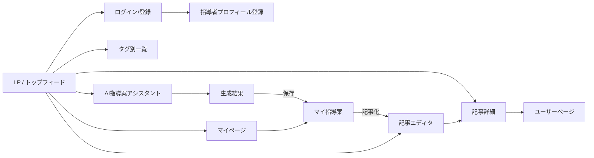

# 05. 画面設計

スマホファースト。グラウンドサイド(練習の合間)での閲覧を想定し、片手操作・大きめタップ領域を基本とする。

## 1. 画面一覧と遷移

## 2. 主要画面の仕様

### 2.1 トップ(フィード)`/`
- タブ: 新着 / (フェーズ2: トレンド・フォロー中)
- 記事カード: タイトル、著者(アイコン+指導カテゴリバッジ)、タグ、いいね数
- 右下FAB: 「✍️ 書く」「⚽ AIに相談」の2アクション

### 2.2 AI指導案アシスタント `/ai`
- **フォームモード**(メイン導線):
  - 年代(セレクト)/ 人数(数値)/ 時間(スライダー)/ テーマ(セレクト+自由入力)/ レベル / 用具 / 補足メモ
  - 「指導案を作成」ボタン → 結果がストリーミング表示
- **チャットモード**: 自由相談。会話履歴を保持し、フォローアップで修正依頼
- 生成結果の下に「💾 保存」「🔁 条件を変えて再生成」「✍️ 記事にする」
- 残り生成回数を表示(例: 今日あと3回)

### 2.3 記事エディタ `/new`
- Zenn風2ペイン(スマホはタブ切替): Markdown入力 / プレビュー
- タイトル、タグ(最大5)、下書き保存 / 公開
- 指導案から遷移した場合は本文がプリセットされる

### 2.4 記事詳細 `/articles/[slug]`
- Markdownレンダリング(見出し目次付き)
- いいねボタン(固定フッター)、著者プロフィールカード
- 同タグの関連記事

### 2.5 オンボーディング `/onboarding`
- 登録直後に必須表示: 指導カテゴリ / 担当年代 / ライセンス(任意)/ 経験年数
- 完了するまで投稿・AI機能はロック(閲覧は可)

### 2.6 マイページ `/[username]`
- プロフィール(指導カテゴリ・年代・ライセンスのバッジ表示)
- タブ: 投稿記事 / (本人のみ)下書き / マイ指導案

## 3. デザイントーン

- 芝生を連想させるグリーンをアクセントカラーに、ベースは白/ダークグレー
- 情報密度は Qiita より Zenn 寄り(余白多め、読みやすさ優先)
- 指導カテゴリバッジ(少年団/クラブ/部活/スクール)で「誰の知見か」を一目で分かるように
